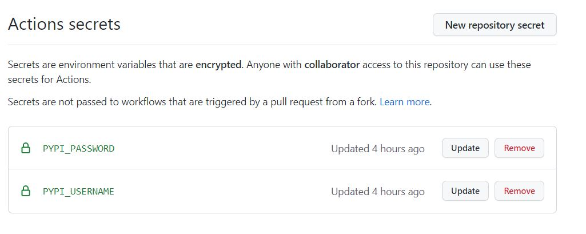

# Github Actions to update package on pypi 
This repo is a reference code to automatically push the latest package release to pypi on creating a github release tags.

#### Step 1: Add required files

  Pypi requires following files to build a package
  - setup.py
  - setup.cfg
  - README.md

  Create a new file `.github\workflows\publish-to-pypi.yml` and copy paste below content.

  ```yaml
  name: Upload Python Package

  on:
    release:
      types: [created]

  jobs:
    deploy:
      runs-on: ubuntu-20.04

      steps:
      - uses: actions/checkout@v2
      - uses: actions/setup-python@v2
      - name: Install dependencies
        run: |
          python -m pip install --upgrade pip
          pip install setuptools wheel twine
      - name: Build and publish
        env:
          TWINE_USERNAME: ${{ secrets.PYPI_USERNAME }}
          TWINE_PASSWORD: ${{ secrets.PYPI_PASSWORD }}
        run: |
          python setup.py sdist bdist_wheel
          twine upload dist/*
  ```

#### Step 2: Update PYPI Creds

  Next add pypi credentials in github secrets with following Keys under settings -> secrets.
  - PYPI_USERNAME
  - PYPI_PASSWORD

  

#### Step 3: Create a release tag
  On creation of release tag, github action will automatically start building distribution files and push them to pypi

#### Step 4: Check Actions
Check whether workflow actions has initiated or not.

#### Step 5: Validate by package installation
  To validate whether package has been pushed to pypi or not.

  Visit pypi website and search for the package name
  
  ```
  pip install packagename
  ```